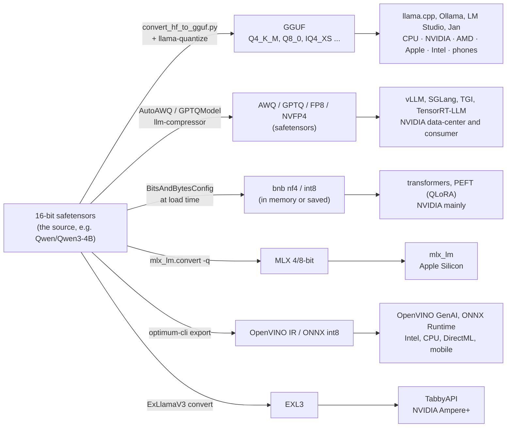
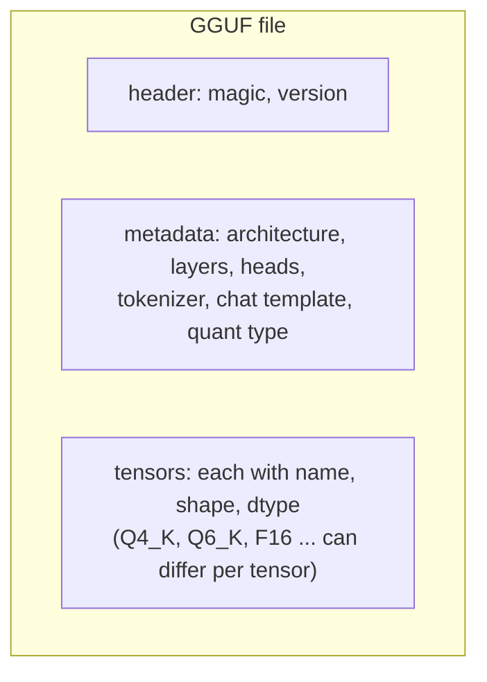
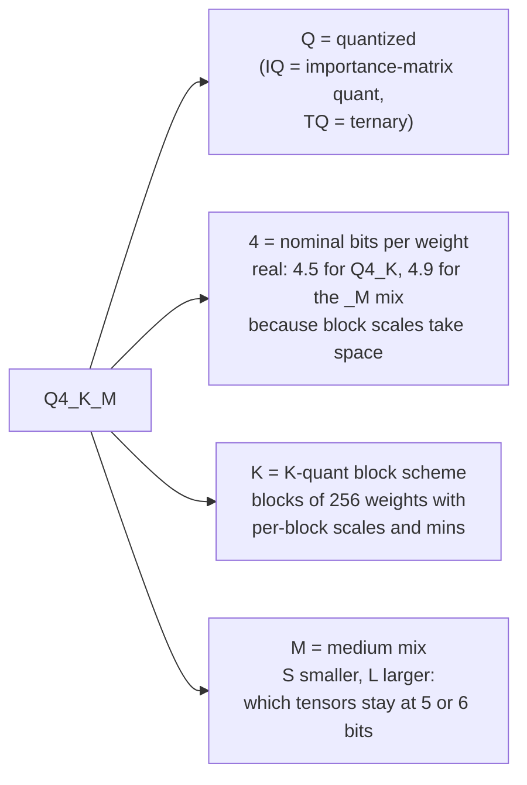
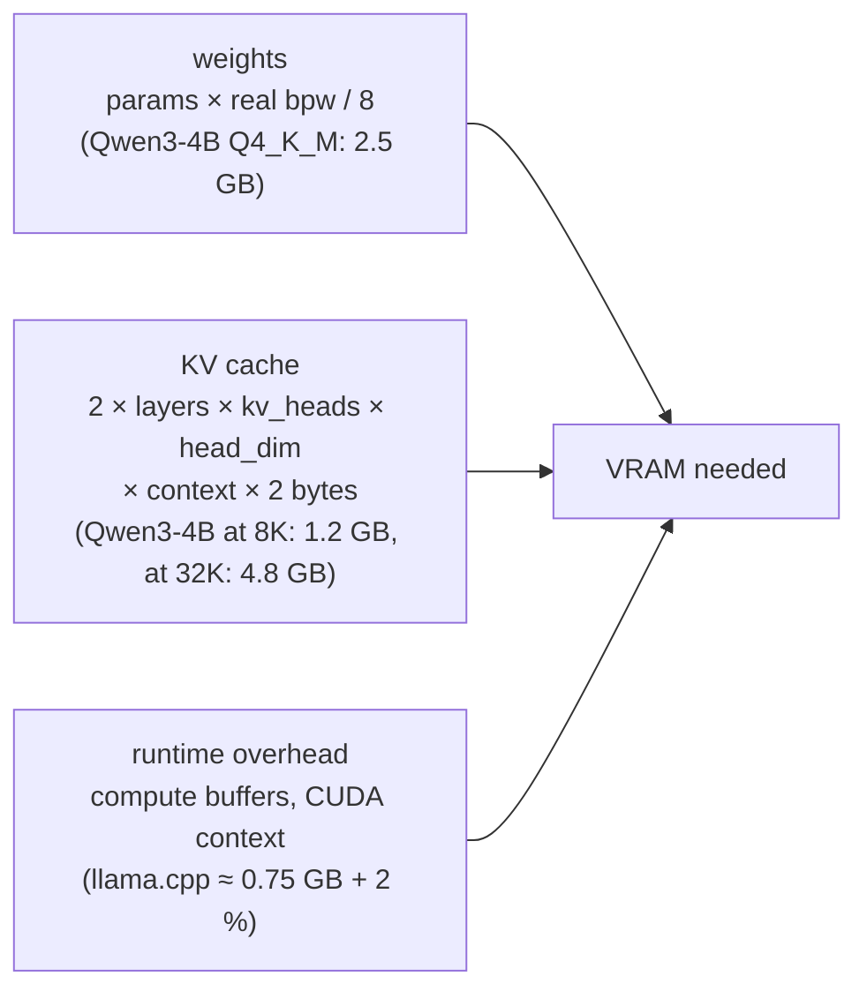
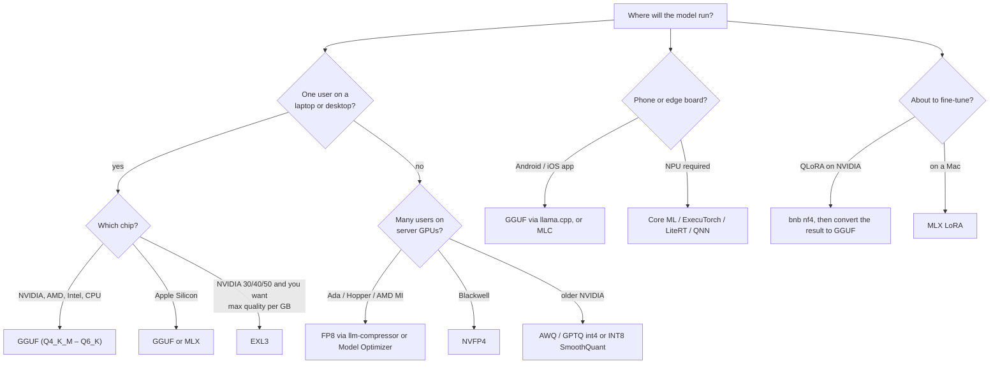

# Choosing a model format: GGUF, safetensors, AWQ, MLX and friends

A beginner's guide to the files Rightsize produces and recommends. If you only remember one thing: **the format decides which hardware and which runtime can load the model**, and the quantization inside a format decides how much memory it needs and how much quality it keeps.

## 1. Three things people mix up

| Term | What it is | Examples |
|---|---|---|
| **Format** | the file layout on disk and the runtime that reads it | GGUF, safetensors, MLX, ONNX, EXL3, Core ML |
| **Quantization** | how many bits each weight is stored in, and how | Q4_K_M, nf4, AWQ int4, FP8, NVFP4 |
| **Runtime** | the program that loads the file and generates tokens | llama.cpp, Ollama, vLLM, mlx_lm, ExLlamaV3 |

A model such as Qwen3-4B is published once, in 16-bit safetensors. Every quantized variant on the Hub was produced from that source by a toolkit, into a format, for a runtime:



## 2. What GGUF is

GGUF is the file format of [llama.cpp](https://github.com/ggml-org/llama.cpp). One file holds everything: the weights (usually quantized), the tokenizer, the chat template and the architecture metadata, so a runtime needs nothing else. It replaced the older GGML format in 2023.



**Why it is the default for local use**

- **Runs on everything.** llama.cpp has backends for CPU (x86 and Arm), NVIDIA (CUDA), AMD (ROCm and Vulkan), Apple Silicon (Metal), Intel (SYCL and Vulkan), and phones (Android via Vulkan or OpenCL, iOS via Metal). The same file works on all of them.
- **Runs when it does not fit.** Layers can be split between GPU and CPU memory (partial offload), so a model larger than your VRAM still runs, slower.
- **Every local app reads it.** Ollama, LM Studio, Jan, GPT4All, KoboldCpp, text-generation-webui; the Hugging Face hub shows which GGUF file fits your saved hardware.
- **Fine-grained quant choices.** K-quants (Q2_K to Q6_K) and I-quants (IQ1 to IQ4) trade size against quality in small steps. Mixed file types such as Q4_K_M keep the sensitive tensors at higher precision.
- **Built-in quality check.** `llama-perplexity --kl-divergence` measures how far a quantized file drifts from the 16-bit original.
- **No GPU needed to make it.** Conversion and quantization run on CPU in minutes for small models.

**Where it is weaker**

- Multi-user serving throughput is below vLLM, SGLang or TensorRT-LLM, which batch requests across many users on data-center GPUs.
- No training. You fine-tune the 16-bit model, then convert.
- Some architectures land in llama.cpp weeks after release; until then there is no GGUF.
- Quality per bit at very low bit rates (2 to 3 bits) trails EXL3 and the newest research formats.

### Reading a quant name



Real bits per weight are higher than the nominal number because the scales take space. Q4_K is 4.5 bpw and the Q4_K_M mix comes to about 4.9 bpw. Rightsize always uses the real number, which is why its predicted file sizes match what `llama-quantize` writes.

Rules of thumb, with the caveat that model size matters:

| You want | Pick | Notes |
|---|---|---|
| near-lossless | Q8_0 or Q6_K | Q6_K is usually indistinguishable from 16-bit |
| the default | Q5_K_M, then Q4_K_M | the community sweet spot; Q4_K_M ≈ 4.9 bpw |
| smallest usable | IQ4_XS, Q3_K_M | i-quants need an importance matrix |
| desperate | IQ2 / IQ1 | noticeable damage; avoid for agentic or tool-use tasks |

Small models (1B to 4B) lose more from aggressive quantization than large ones. For a 1B model, Q8_0 is the sensible floor; for 4B, Q5_K_M or Q6_K.

### What actually fills your GPU memory

The file size is only the first term. Rightsize predicts all three:



The KV cache is why "the file is 2.5 GB so it fits in 4 GB" is often wrong at long context.

### The importance matrix (imatrix)

An imatrix is computed by running calibration text through the 16-bit model and recording which weights matter most. `llama-quantize --imatrix` then spends bits where they count. It improves every quant type a little and is **required** for i-quants. Rightsize renders it as a separate step because it takes minutes and needs the calibration text.

## 3. The alternatives, with pros and cons

| Format | Made by | Runs on | Strengths | Weaknesses | Pick it when |
|---|---|---|---|---|---|
| **safetensors, 16-bit** | every trainer | anything with enough memory | the source of truth; loads in transformers, vLLM, SGLang; needed for fine-tuning | 2 bytes per weight: a 4B model is 8 GB, a 70B model is 140 GB | you will fine-tune or serve on big GPUs |
| **bitsandbytes nf4 / int8** (inside safetensors) | transformers `BitsAndBytesConfig` | NVIDIA; partial AMD and Apple | loads on the fly, no calibration; the base for QLoRA fine-tuning | slower than AWQ or GGUF at inference; NVIDIA-centric; on models under ~3B it can cost more energy than 16-bit | you are about to fine-tune with QLoRA |
| **AWQ / GPTQ int4** (safetensors) | AutoAWQ, GPTQModel, llm-compressor | NVIDIA (AWQ also Intel and CPU) | fast INT4 kernels in vLLM, SGLang, TGI; good quality at 4 bits | needs calibration data; not for CPU or Apple in practice | you serve many users on NVIDIA |
| **FP8, INT8 SmoothQuant** (compressed-tensors) | llm-compressor, TensorRT Model Optimizer | Ada, Hopper, Blackwell; AMD MI for FP8 | halves memory and roughly doubles throughput; near-lossless | needs the right tensor cores; no consumer AMD, no Apple | production serving on recent GPUs |
| **NVFP4 / MXFP4** | TensorRT Model Optimizer, llm-compressor, Unsloth Dynamic NVFP4 | Blackwell only (RTX 50, B200, DGX Spark) | 4-bit weights **and** activations, 2 to 3x decode throughput | one GPU generation; still young | you have Blackwell and serve at scale |
| **EXL3** | ExLlamaV3 | NVIDIA Ampere and newer | best quality per bit on consumer NVIDIA, 1 to 8 bpw | one vendor; own server (TabbyAPI); not loadable by vLLM or Ollama | you are on a 3090/4090/5090 and want the most quality in the least VRAM |
| **MLX** | `mlx_lm.convert -q` | Apple Silicon only | fastest on Macs; Ollama 0.19+ uses it under the hood | Apple only | you deploy to Macs |
| **OpenVINO IR** | `optimum-cli export openvino` | Intel CPU, iGPU, NPU | the Intel laptop and edge path; int4 weight compression | Intel only | you deploy to Intel machines |
| **ONNX int8** | optimum-onnx, ONNX Runtime | CPU, DirectML, mobile | the standard for embeddings, vision and small models; portable | LLM support lags; no partial offload | embeddings, vision, small LLMs on CPU |
| **MLC** | MLC LLM | CUDA, ROCm, Metal, Vulkan, WebGPU, iOS, Android | one compile to every backend, including the browser | compiles per target; smaller community | you ship the same model to web and phones |
| **Core ML, ExecuTorch, LiteRT, QNN** | coremltools, ExecuTorch, AI Edge Torch, Qualcomm AI Hub | iPhone Neural Engine, Android NPU, Snapdragon | the only way onto phone NPUs | per-device tuning; profiling on real devices | the mobile phase |

The same trade-off runs through the table: **GGUF and MLC are portable, the GPU-vendor formats are fast on their vendor, and the mobile-native formats are fast on one chip.**

### Which format for which target



## 4. How Rightsize uses this

- The **fit engine** predicts memory from the real bits per weight of the chosen format and the KV cache at your context length (`docs/plans/F03-fit-engine.md`).
- The **rules** encode which format runs where, with a source URL each, so a plan never proposes FP8 on an RTX 3060 or AWQ on a Mac (`docs/plans/F04-rules-engine.md`).
- The **registry** renders the exact command for the toolkit that makes the format (`docs/plans/F05-framework-registry.md`, inventory in `docs/plans/01-libraries.md`).
- The first shipped path is GGUF via llama.cpp, because it is the one artifact that reaches CPU, NVIDIA, AMD, Apple, Intel and phones, and because it needs no GPU to produce. Try it:

```bash
rightsize estimate Qwen/Qwen3-4B --quant Q4_K_M --quant Q8_0     # predict only, no download
rightsize tools install llama.cpp                                  # once: pinned binaries + converter
rightsize quantize Qwen/Qwen3-4B --quant Q4_K_M --imatrix --eval  # convert, quantize, measure, gate
```

## 5. Further reading

- Hugging Face Optimum, [Quantization concepts](https://huggingface.co/docs/optimum/en/concept_guides/quantization): the math of scales, zero-points, calibration.
- NVIDIA, [Model quantization: concepts, methods and why it matters](https://developer.nvidia.com/blog/model-quantization-concepts-methods-and-why-it-matters/) and [Optimizing LLMs with post-training quantization](https://developer.nvidia.com/blog/optimizing-llms-for-performance-and-accuracy-with-post-training-quantization/).
- llama.cpp, [GGUF specification](https://github.com/ggml-org/ggml/blob/master/docs/gguf.md) and the quant type list in `llama-quantize --help`.
- Our own notes: `docs/plans/02-quantization-concepts.md`.
